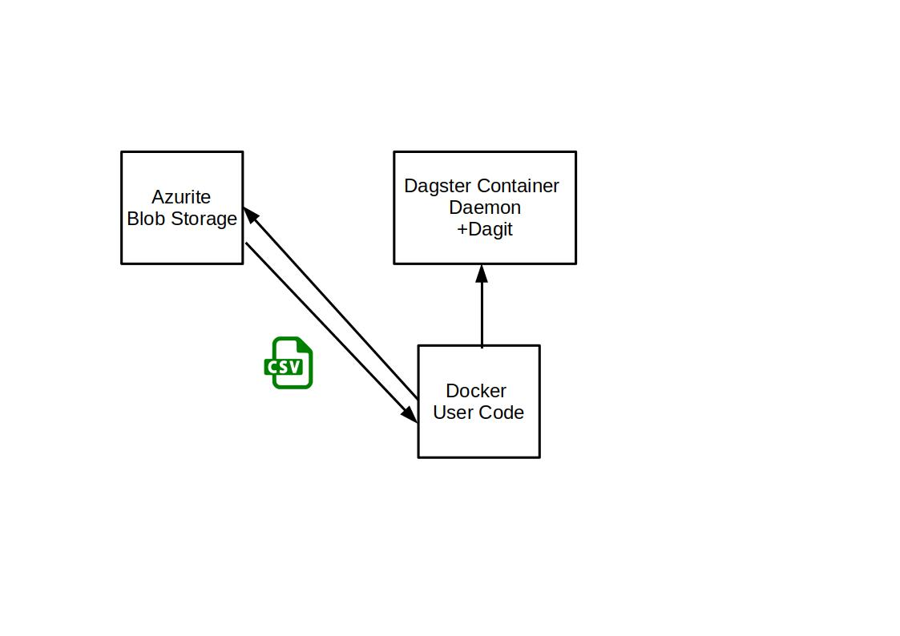
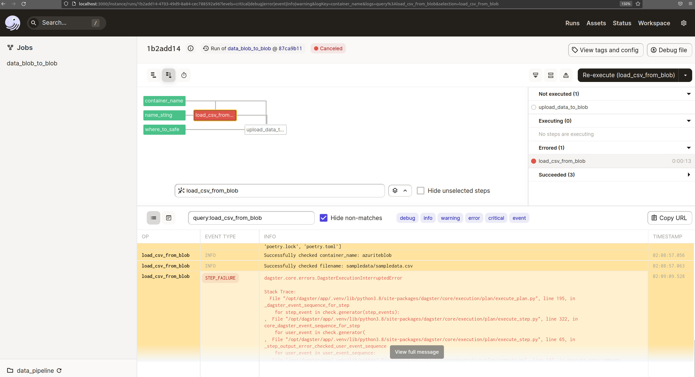
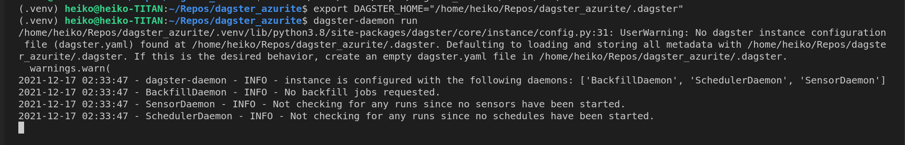
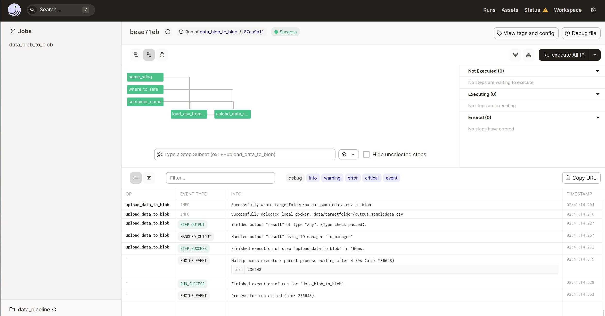

# Dagster_Azurite


This Dagster Azurite Repo connects to the local running Azurite Blobstorage.

Dagster: Dagster Daemon and Dagit are running in its own container.


The User Sample Code (in its own container) will pull data from Blobstorage and will write it back into a separeted folder.





To start the docker container

```bash

docker-compose up --build

```


And to remove the docker container

```bash

docker-compose down 

``` 

When executing the script to pull and push the data from azurite blobstorage the solid using the azurite resource fails.




Run it locally without docker set some variables for dagit and dagster daemon.


```bash
# in bash

export DAGSTER_HOME="/home/heiko/Repos/dagster_azurite/.dagster"
dagster-daemon run
```




```bash
# in Powershell

Set-Variable -Name "DAGSTER_HOME" -value "./.dagster"
dagit -f repository.py

```




