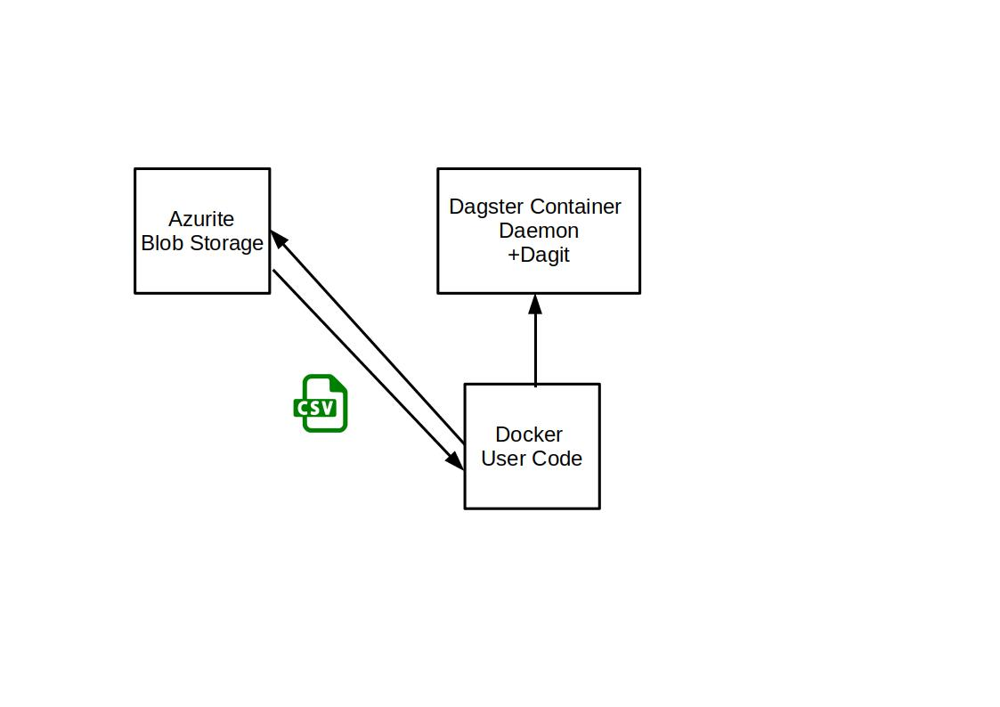
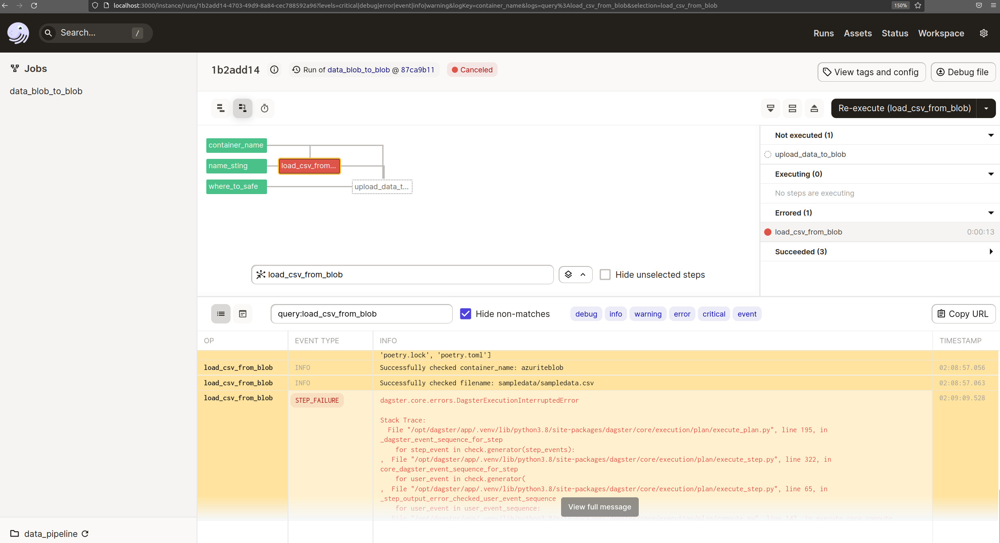

# Dagster_Azurite

This Dagster Azurite Repo connects to the local running Azurite Blobstorage.

Dagster: Dagster Daemon and Dagit are running in its own container.

The User Sample Code (in its own container) will pull data from Blobstorage and will write it back into a separeted folder.

